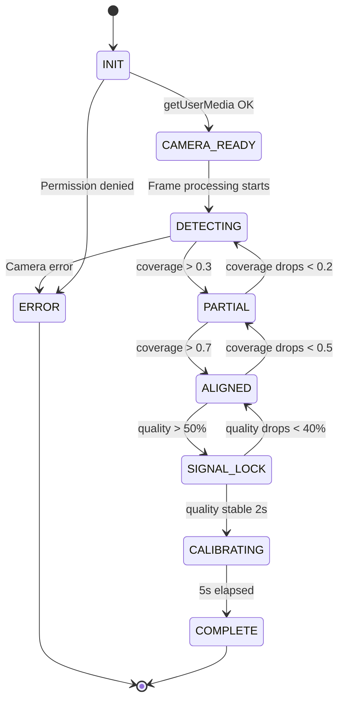

# TENKI Event Schema V2 — Canonical Payload Specification

> **Version**: 1.0.0  
> **Status**: Draft  
> **Author**: TENKI PRO Team  
> **Last Updated**: 2026-02-14

---

## 1. Design Principles

1. **Single Source of Truth** — 每個 payload 都是 canonical，跨模組唯一標準
2. **PR99 Scale** — TEI 採用 Percentile Rank (1-99)，統計學正確
3. **tenki:* Namespace** — 所有事件使用 `tenki:` 前綴
4. **Versioned** — 每個 payload 包含 `v: 1` schema version
5. **Validated** — EventBridgeV2 對所有 payload 做 runtime 驗證

---

## 2. Canonical Payloads

### 2.1 TenkiSensorSample

**用途**: 任何生理感測器 → TEI 引擎的原始輸入

```typescript
interface TenkiSensorSample {
    v: 1;                              // Schema version
    ts: number;                        // Timestamp (ms since epoch)
    source: 'rppg' | 'healthkit' | 'watch' | 'manual' | 'sim';
    hr_bpm: number;                    // Heart rate (40-180)
    hrv_ms: number;                    // HRV RMSSD (ms)
    quality: number;                   // Signal quality (0-1)
    meta?: {
        motion?: number;               // Motion intensity (0-1)
        coverage?: number;             // Finger coverage (0-1, PPG only)
        light?: number;                // Light quality (0-1)
    };
}
```

**Validation Rules**:
| Field | Type | Required | Range |
|-------|------|----------|-------|
| `v` | number | ✅ | `1` |
| `ts` | number | ✅ | `> 0` |
| `source` | string | ✅ | enum |
| `hr_bpm` | number | ✅ | `40-180` |
| `hrv_ms` | number | ✅ | `> 0` |
| `quality` | number | ✅ | `0-1` |

---

### 2.2 TenkiTEIResult

**用途**: ProgressiveTEI → UI/Decision/Logging 的輸出

> [!IMPORTANT]
> TEI 使用 **PR99 (Percentile Rank)** 尺度 (1-99)  
> PR99 = 「你的狀態優於 X% 的歷史記錄」

```typescript
interface TenkiTEIResult {
    v: 1;
    ts: number;
    tei_pr99: number;                  // 1-99 (Percentile Rank)
    confidence: number;                // 0-1
    level: 'quick' | 'standard' | 'precise' | 'ultra';
    error_margin_pr99: number;         // ±error (PR99 scale)
    range_pr99: [number, number];      // [lower, upper]
    inputs: {
        sources: string[];             // e.g. ['rppg', 'healthkit']
        samples_used: number;
        quality_avg: number;
    };
    baseline?: {
        hr_bpm: number;
        confidence: number;
    };
}
```

**Precision Level Thresholds**:
| Level | Time | Confidence | Error Margin |
|-------|------|------------|--------------|
| `quick` | 2s | 0.3-0.5 | ±15-20 |
| `standard` | 15s | 0.6-0.75 | ±8-12 |
| `precise` | 30s | 0.8-0.9 | ±4-6 |
| `ultra` | 60s | 0.92-0.98 | ±2-3 |

---

### 2.3 TenkiPPGCalibrationMetrics

**用途**: PPG 校準完成時的量化指標

```typescript
interface TenkiPPGCalibrationMetrics {
    v: 1;
    ts: number;
    session_id: string;
    time_to_aligned_ms: number;
    time_to_signal_lock_ms: number;
    final_quality: number;             // 0-1
    bpm_estimate: number;
    state_transitions: Array<{
        from: string;
        to: string;
        time_ms: number;
    }>;
    coverage_history: Array<{
        time_ms: number;
        coverage: number;
    }>;
}
```

---

### 2.4 TenkiTradeRecord

**用途**: Expectancy Layer 的交易記錄

```typescript
interface TenkiTradeRecord {
    v: 1;
    trade_id: string;
    ts: number;
    symbol: string;
    direction: 'long' | 'short';
    outcome: 'win' | 'loss' | 'breakeven' | 'timeout' | 'abort';
    pnl: number;
    r_multiple: number;
    template: 'CANSLIM' | 'DARVAS' | 'FBD' | 'CUSTOM';
    decision_time_s: number;
    tei_at_entry: {
        tei_pr99: number;
        confidence: number;
        range_pr99: [number, number];
    };
    notes?: string;
}
```

---

## 3. Official Event Table

### 3.1 Core Events (tenki:*)

| Event | Payload | Purpose | Frequency |
|-------|---------|---------|-----------|
| `tenki:sensor-sample` | `TenkiSensorSample` | 原始數據 | Throttled 10Hz |
| `tenki:sensor-samples-batch` | `{ samples: TenkiSensorSample[] }` | 批量數據 | 10Hz |
| `tenki:tei-progressive` | `TenkiTEIResult` | TEI 更新 (canonical) | ~1Hz |
| `tenki:ppg-state` | `{ state, coverage, quality, hint }` | PPG 狀態 | Event-driven |
| `tenki:ppg-coverage` | `{ coverage, hint }` | 覆蓋率 | 10Hz |
| `tenki:ppg-signal` | `{ quality, bpm }` | 信號品質 | 10Hz |
| `tenki:ppg-complete` | `TenkiPPGCalibrationMetrics` | 校準完成 | Once |
| `tenki:trade-recorded` | `TenkiTradeRecord` | 交易記錄 | Event-driven |

### 3.2 PPG State Machine



### 3.3 Legacy Event Mapping

| Legacy Event | New Event | Strategy |
|-------------|-----------|----------|
| `tenki:tei-updated` | `tenki:tei-progressive` | Alias with deprecation flag |
| `tenki:ppg-calibration` | `tenki:ppg-state` | Payload transformation |
| `ppg:coverage-update` | `tenki:ppg-coverage` | Direct rename |
| `ppg:signal-update` | `tenki:ppg-signal` | Direct rename |
| `ppg:complete` | `tenki:ppg-complete` | Payload upgrade |
| `tei:update` | `tenki:tei-progressive` | Remove in Phase 3 |

---

## 4. Throttling Strategy

```
Source:   rPPG @ 30 FPS
                ↓ (buffer)
Throttle: sensor-sample @ 10 Hz (100ms batches)
                ↓ (process)
Output:   tei-progressive @ ~1 Hz
```

**Performance Target**:
| Metric | Before | After |
|--------|--------|-------|
| Events/sec | 150 | 50 |
| CPU (mobile) | ~60% | <40% |
| Memory | Growing | Stable |
